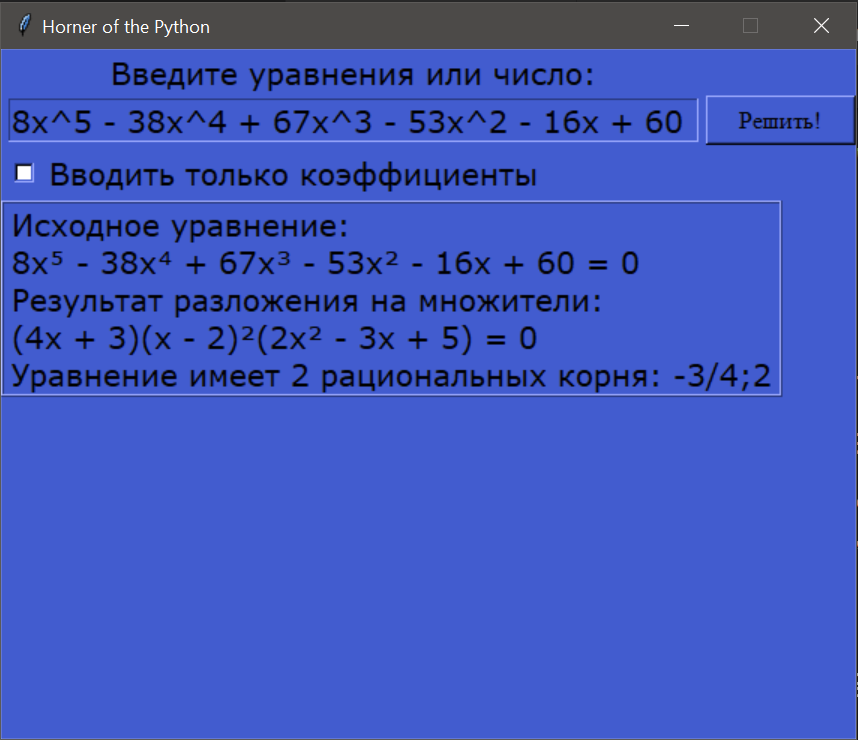

# О программе

Программа позволяет решать уравнения высоких степеней в рациональных числах и раскладывать на множители многочлены от одной переменной. Основана на встроеных в Python модулях Tkinter и Fractions.

# Как работает
В основе лежит схема Горнера - математический метод разложения многочлена n-й степени. Этот метод также позволяет находить рациональные корни уравнений.

# Как пользоваться
Введите в окно для ввода левую часть уравнения (правая часть будет равна 0).
У программы есть 2 способа ввода:
1) Ввод всего уравнения в общем виде. Если нужно, например, найти корни уравнения 8x⁵ - 38x⁴ + 67x³ - 53x² - 16x + 60 = 0, нужно ввести: 8x^5 - 38x^4 + 67x^3 - 53x^2 - 16x + 60.
2) Ввод только коэффициентов уравнения (по умолчанию). Позволяет не вводить уравнение целиком. Например вместо ввода уравнения x³ + 2x² - 5x - 6 нужно ввести только: 1 2 -5 -6. Также имеется возможность вводить целые числа и получать его простые множители (работает в режиме коэффициентов).